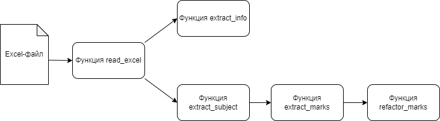

## An?lScore

### Предварительный план работы
An?lScore это проект, предназначенный для анализа оценок из электронного дневника. На вход ему подаётся файл в формате `.xlsx`, а на выходе получаются визуализации оценок по разным предметам.

### Логика работы
Логика обработки файла Excel представлена на рисунке ниже:

<p align="center">
    
</p>

В начале файл Excel (должен быть расположен в папке `data`!) считывается при помощи функции `read_excel` и записывается в формате `openpyxl.Workbook`.

Затем, у считанного файла пользователь сам выбирает необходимый ему лист, на котором расположены данные. После выбора данных пользователем есть 2 пути развития событий: вывести основную информацию, находящуюся в верхней части листа при помощи `extract_info`.

Второй путь заключается в обработке и выводе отметок. Сперва, при помощи функции `extract_subjects` можно получить словарь предметов, которые есть у ученика. Выглядит он следующим образом:
```json
{
    '1': "Изобразительное искусство",
    '2': "Иностранный язык",
    ...
}
```

Далее по данному словарю создается словарь отметок при помощи функции `extract_marks`, примерный вид которого представлен ниже:
```json
{
    "Изобразительное искусство": 
    [
        {"Дата": "23.09.2024", "Отметка": "4"},
        {"Дата": "07.10.2024", "Отметка": "5"},
        {"Дата": "21.10.2024", "Отметка": "5"},
        {"Дата": "21.10.2024", "Отметка": "4"},
        ...
    ],
    "Иностранный язык (английский)":
    [
        ...
    ],
    ...
}
```

И наконец для более удобной работы с отметками и датами их можно преобразовать в 2 массива при помощи функции `refactor_marks`. Например, для предмета `Изобразительное искусство`, получаемые массивы будут выглядеть следующим образом:
```python
dates = ["23.09.2024", "07.10.2024", "21.10.2024", "21.10.2024", ...]
marks = ["4", "5", "5", "4"]
```